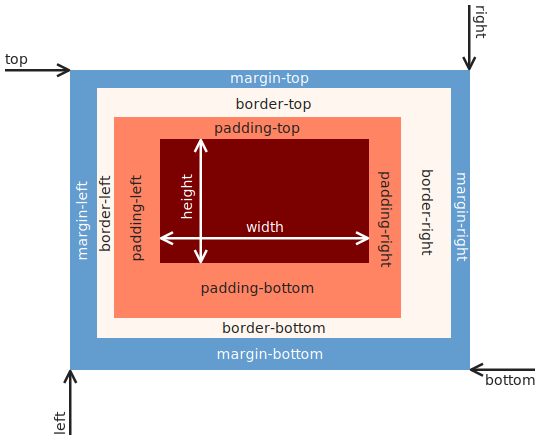

<style>
  img[alt~="rightbound"] {
    margin-top: -124px;
    height: 310px;
    margin-right: 150px;
    }
</style>

# CSS Grundlagen

_Martin Kleindienst_

<!--_paginate: false -->

---

## Motivation

Wie können wir sicherstellen, dass das Bild unseres HTML Dokuments immer eine passende Größe hat?

Es wäre doch praktisch, wenn sich die Bildgröße abhängig von der Fensterbreite verändert.

---

## CSS

<div style='float:right'>

  

</div>

- **C**ascading **S**tyle **S**heets
- Erstveröffentlichung: 1996
- Aktuelle Version: CSS3
- Dateiendung: .css
- CSS wird verwendet, um das Design und Layout von HTML-Dokumenten zu definieren!
- Kommentare werden mit `/*` zum Öffnen und `*/` zum Schließen erstellt

---

### Einbinden von "External CSS"

``` html
<!DOCTYPE html>
<html>
  <head>
    <meta charset="utf-8"/>
    <meta name="viewpoint" content="width=device-width, initial-scale=1.0"/>
    <title>CSS is Awesome</title>
    <link rel="stylesheet" href="https://www.w3schools.com/w3css/5/w3.css">
  </head>
  <style>
    /* Hier wäre Platz für "Internal CSS". Aber dazu auch gleich mehr */
  </style>
</html>
```

---

### Einbinden von "Internal CSS"

``` html
<!DOCTYPE html>
<html>
  <head>
    <meta charset="utf-8"/>
    <meta name="viewpoint" content="width=device-width, initial-scale=1.0"/>
    <title>CSS is Awesome</title>
  </head>
  <style>
    h1 {
      color: maroon;
      font-size: 40px;
    }
    .specialstyle {
      color: lightblue;
    }
  </style>
  <body>
    <h1>CSS is Awesome</h1>
    <p class="specialstyle">
      CSS macht es uns möglich unsere HTML Dokumente ansprechend zu gestalten.
    </p>
  </body>
</html>
```

---

### Einbinden von "Inline CSS"

``` html
<!DOCTYPE html>
<html>
  <head>
    <meta charset="utf-8"/>
    <meta name="viewpoint" content="width=device-width, initial-scale=1.0"/>
    <title>CSS is Awesome</title>
  </head>
  <body>
    <h1 style="color: maroon; font-size: 40px">CSS is Awesome</h1>
      <p style="color: lightblue">
      CSS macht es uns möglich unsere HTML Dokumente ansprechend zu gestalten.
    </p>
  </body>
</html>
```

---

### Wie geht das jetzt mit dem Bild?

``` html
<!DOCTYPE html>
<html>
  <head>
    <meta charset="utf-8"/>
    <meta name="viewpoint" content="width=device-width, initial-scale=1.0"/>
    <title>CSS is Awesome</title>
  </head>
  <body>
    <h1>CSS is Awesome</h1>
    
  </body>
</html>
```

---

### Einheiten

<div style="display: flex">
  <div style="flex: 1">
    <h4>Absolut</h4>
    <ul>
      <li>cm</li>
      <li>mm</li>
      <li>pt</li>
      <li>px</li>
      <li>...</li>
    </ul>
  </div>
  <div style="flex: 2">
    <h4>Relativ</h4>
    <ul>
      <li>% (Anteil an verfügbaren Platz)</li>
      <li>vw (Anteil der viewpoint Breite)</li>
      <li>vh (Anteil  der viewpoint Höhe)</li>
      <li>...</li>
    </ul>
  </div>
</div>

<!-- _footer: https://web.dev/learn/css/sizing -->

---

### CSS Boxmodell [1]



<!-- _footer: https://en.wikipedia.org/wiki/CSS_box_model#/media/File:Boxmodell-detail.png -->

---

### CSS Boxmodell [2]

``` html
  <style>
    .boxstyle {
      padding-top: 14px;
      padding-right: 44px;
      padding-bottom: 50px;
      padding-left: 80px;
      border-style: solid;
      border-width: 25px 10px 4px 35px;
      margin-top: 100px;
      margin-bottom: 100px;
      margin-right: 150px;
      margin-left: 80px;
    }
  </style>
```

---

### Flex Boxes

``` html
<style>
  .container {
    display: flex;
    flex-wrap: wrap;
  }
</style>
<body>
  <div class="container">
    <div>
      <h2>Linke Seite</h4>
    </div>
    <div>
      <h2>Rechte Seite</h4>
    </div>
  </div>
</body>
```

---

## Auftrag [1]

- Kommentiere das Bild aus. (Wir machen später damit etwas.)
- Lege eine Farbpalette für dein HTML Dokument fest. Du kannst dafür z.B. [diese Seite](https://www.realtimecolors.com/) nutzen.
- Ändere für das gesamte Dokument die Schriftart. [Tipp](https://www.w3docs.com/snippets/css/how-to-apply-global-font-to-the-entire-html-document.html)
- Nutze die Farben und passe damit die Überschriften und Texte an.
- Gib jedem zweiten Abschnitt (damit ist Überschrift + Weiteres Element gemeint) die gleiche Hintergrundfarbe.

---

## Auftrag [2]

- Füge Zwischen den Abschnitten einen Übergang mit einer Vektorgrafik ein.
- Nutze zum Erstellen der Vektorgrafik am besten [diese Seite](https://yqnn.github.io/svg-path-editor/#P=M_0_120_L_120_101.2_C_240_82.8_480_45.2_720_54.8_C_960_64_1200_120_1440_169.2_C_1680_218.8_1920_261.2_2160_296.8_C_2400_332_2640_360_2880_313.2_C_3120_266.8_3360_145.2_3480_84.8_L_3600_24_V_380_H_0_Z).
- Tipp: Setze den `fill` parameter auf `fill="var(--DEINFARBENNAME)"`

---

## Auftrag [3]

- Füge im Abschnitt ``Zutaten`` das Bild wieder ein.
- Stelle sicher, dass das Bild abhängig von der Fenstergröße entweder neben oder unter der Liste mit den Zutaten angezeigt wird.

---

## Auftrag [4]

Füge ein fixiertes Menü für die einzelnen Überschriften ein.

- Wenn du auf eine der Überschriften im Menü clickst solltest du direkt zum jeweiligen Abschnitt hüpfen.
Tipp: Verwende dazu das ``<a>`` Element.
- Orientieren dich gegebenenfalls an diesem [Tutorial](https://www.w3schools.com/howto/howto_css_fixed_menu.asp).

---

## Zusatzauftrag

Stöbere in den Templates von
<https://www.free-css.com/free-css-templates>
und such dir eines davon aus.

Notiere dir, was dir an diesem Template so gut gefällt.
