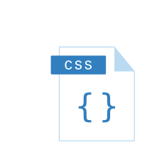

<style>
  img[alt~="rightbound"] {
    margin-top: -124px;
    height: 310px;
    margin-right: 150px;
    }
</style>

# CSS Grundlagen

_Martin Kleindienst_

<!--_paginate: false -->

---

## CSS

<div style='float:right'>

  

</div>

- **C**ascading **S**tyle **S**heets
- Erstveröffentlichung: 1996
- Aktuelle Version: CSS3
- Dateiendung: .css
- CSS wird verwendet, um das Design und Layout von HTML-Dokumenten zu definieren!
- Kommentare werden mit `/*` zum Öffnen und `*/` zum Schließen erstellt

---

### Einbinden von "External CSS"

``` html
<!DOCTYPE html>
<html>
  <head>
    <meta charset="utf-8"/>
    <meta name="viewpoint" content="width=device-width, initial-scale=1.0"/>
    <title>Big Brother Award</title>
    <link rel="stylesheet" href="https://www.w3schools.com/w3css/5/w3.css">
  </head>
  <style>
    /* Hier wäre Platz für "Internal CSS". Aber dazu auch gleich mehr */
  </style>
</html>
```

---

### Einbinden von "Internal CSS"

``` html
<!DOCTYPE html>
<html>
  <head>
    <meta charset="utf-8"/>
    <meta name="viewpoint" content="width=device-width, initial-scale=1.0"/>
    <title>Big Brother Award</title>
  </head>
  <style>
    h1 {
      color: maroon;
      margin-left: 40px;
    }
    .specialstyle {
      color: lightblue;
    }
  </style>
  <body>
    <h1>Der Big Brother Award</h1>
      <p class="specialstyle">
      Der Big Brother Award zeichnet Personen...
    </p>
  </body>
</html>
```

---

### Einbinden von "Inline CSS"

``` html
<!DOCTYPE html>
<html>
  <head>
    <meta charset="utf-8"/>
    <meta name="viewpoint" content="width=device-width, initial-scale=1.0"/>
    <title>Big Brother Award</title>
  </head>
  <body>
    <h1 style="color: maroon; margin-left: 40px">Der Big Brother Award</h1>
      <p style="color: lightblue">
      Der Big Brother Award zeichnet Personen...
    </p>
  </body>
</html>
```

---

## Arbeitsauftrag

Such dir ein Template von
<https://www.free-css.com/free-css-templates>
aus und füge dein Gericht in das Template ein.

Passe dabei die Überschriftsebenen und die generelle Struktur deines ursprünglichen Dokuments an
