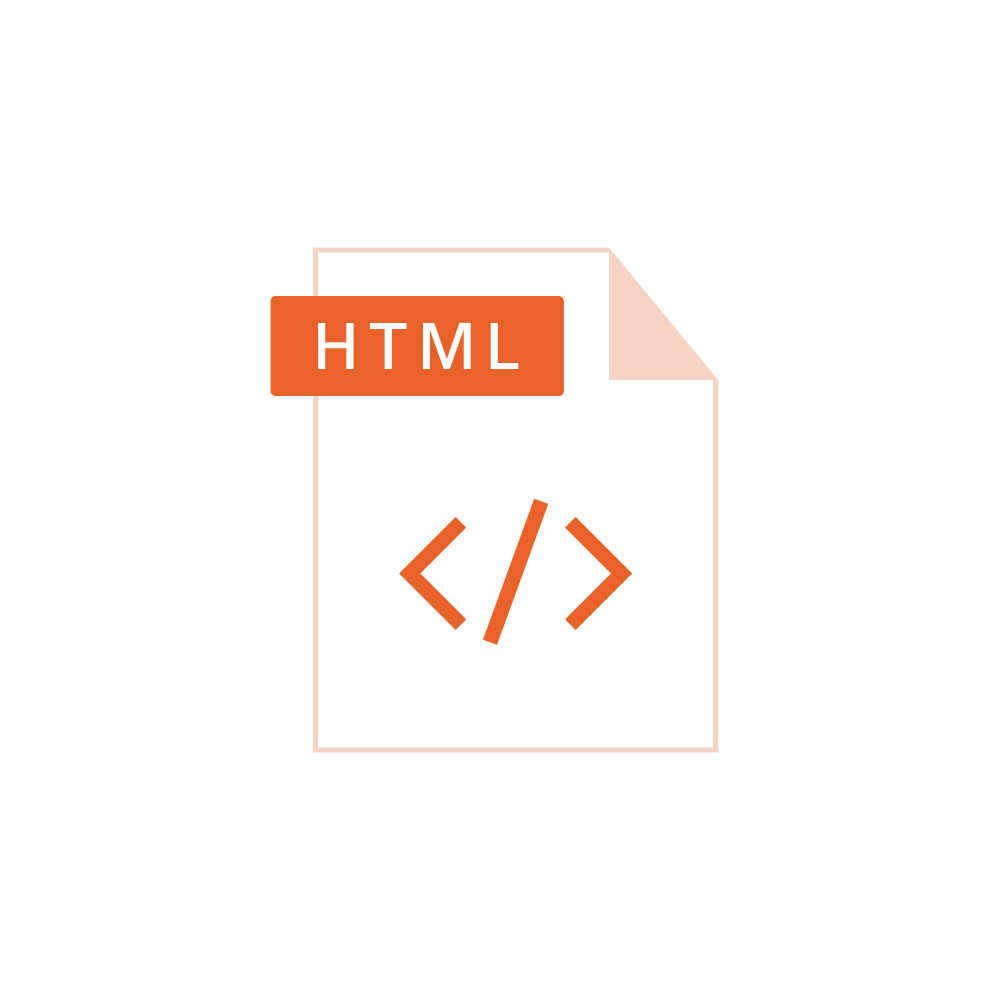

<style>
  img[alt~="rightbound"] {
    margin-top: -180px;
    height: 600px;
    margin-right: -70px;
    }
</style>

<!-- <style scoped>
h1, h4 {
  color: oklch(0.879 0.169 91.605);
}
</style> -->

# HTML Grundlagen

_Martin Kleindienst_

<!--_paginate: false -->

---

## Motivation [1]

<style scoped>
  footer {
  margin-bottom: 0px;
  height: 120px;
  /* background: red; */
  }
</style>

- Was ist der Unterschied zwischen einer **MS Word** Datei
und einer **Zip** Datei?


<div style="height: 140px;"></div>

* Ändere die Dateiänderung einer **MS Word** Datei auf **.zip** !

<!-- _footer: https://pixabay.com/vectors/zip-compressed-icon-archive-win-7040223/ </br> https://pixabay.com/vectors/microsoft-office-word-icon-file-7040222/
-->
---

## Motivation [2]


<!--  -->

<svg width="1200" height="500" style="position: absolute; z-index: 2; margin-left: -55px; margin-top: -10px">
  <line x1="0" y1="170" x2="693" y2="0" stroke="gray" stroke-width="4"/>
  <line x1="80" y1="170" x2="1200" y2="0" stroke="gray" stroke-width="4" />
  <line x1="00" y1="235" x2="693" y2="450" stroke="gray" stroke-width="4" />
  <line x1="80" y1="235" x2="1200" y2="450" stroke="gray" stroke-width="4" />
</svg>


<!--  -->

---

## HTML

<div style='float:right'>

  

</div>

- **H**yper**t**ext **M**arkup **L**anguage
- Erstveröffentlichung: 1992
- Aktuelle Version:
HTML 5.2 (14.12.2017)
- Dateiendungen: .html .htm
- **Leerzeichen und Zeilenumbrüche werden nicht ausgewertet!**
- Kommentare werden mit `<!--` zum Öffnen und `-->` zum Schließen erstellt

<!-- _footer: https://pixabay.com/vectors/file-format-type-extension-cutout-7084006/ -->

---

### Die ersten Zeichen von jedem HTML Dokument

``` html
<!DOCTYPE html>
<html>


</html>
```

---

### Das "head" Element

``` html
<!DOCTYPE html>
<html>
  <head>
    <meta charset="utf-8"/>
    <meta name="viewpoint" content="width=device-width"/>
    <title>Big Brother Award</title>
    <!-- usw. Beispielsweise wird hier auch das externe CSS eingebunden -->
    <!-- aber dazu später mehr -->
  </head>
  <style>
    /* Hier wäre Platz für internes CSS. Aber dazu auch später mehr */
  </style>

</html>
```

---

### Das "style" Element

``` html
<!DOCTYPE html>
<html>
  <head>
    <meta charset="utf-8"/>
    <meta name="viewpoint" content="width=device-width"/>
    <title>Big Brother Award</title>
    <!-- usw. Beispielsweise wird hier "External CSS"  -->
    <!-- eingebunden, aber dazu später mehr. -->
  </head>
  <style>
    /* Hier wäre Platz für "Internal CSS". Aber dazu auch später mehr */
  </style>

</html>
```

---

### Das "body" Element

``` html
<!DOCTYPE html>
<html>
  <head>
    <meta charset="utf-8"/>
    <meta name="viewpoint" content="width=device-width"/>
    <title>Big Brother Award</title>
  </head>
  <style>
    /* Hier wäre Platz für "Internal CSS". Aber dazu auch später mehr */
  </style>
  <body>
    <!-- Hier kommt dann der Content rein -->
  </body>
</html>
```

---

``` html
<!DOCTYPE html>
<html>
  <head>
    <meta charset="utf-8"/>
    <meta name="viewpoint" content="width=device-width"/>
    <title>Big Brother Award</title>
  </head>
  <body>
    <h1>Der Big Brother Award</h1>
    <p>
      Der Big Brother Award zeichnet Personen und
      Institutionen aus, die in besonders negativer Weise
      zur Einschränkung der Privatsphäre und der
      Grundrechte in der digitalen Welt beigetragen haben.
    </p>
  </body>
<html>
```

---

#### Und wozu jetzt der Spaß?

<style scoped>
  footer {
  margin-bottom: 0px;
  height: 120px;
  }
</style>

- Wir erinnern uns an Word vs. Zip
- Wie wäre es wenn wir hier auch ausprobieren, dass .txt Dokument in .html (oder .htm) umzubenennen.

  <div style="display: flex; align-items: center; justify-content: center">
    <div style="margin: 0 10px">
      
    </div>
    <svg style="width: 100px; height: 100px; fill: #455a64" xmlns="http://www.w3.org/2000/svg" viewBox="0 0 16 12">
      <path d="M 0 3.25 H 11 l -3 -3.25 h 2 l 4 4 l -4 4 h -2 l 3 -3.25 H 0 Z"/>
    </svg>
    <div style="margin: 0 10px">
      
    </div>
  </div>

<!-- _footer: https://pixabay.com/vectors/file-format-type-extension-doc-7054984/ </br> https://pixabay.com/vectors/file-format-type-extension-cutout-7084006/
-->

---

## Gibt's nicht was besseres zum Arbeiten?

<style scoped>
  footer {
  margin-bottom: 0px;
  height: 120px;
  }
</style>

<div style="height: 90px;"></div>

<div style="display: flex">
  <div style="flex: 1; text-align: center">
    <h4>Visual Studio </br> Code</h4>
    
  </div>
  <div style="flex: 1.6; text-align: center;">
    <h4>Visual Studio Code </br> Live Preview Extension</h4>
    
  </div>
</div>

<!-- _footer: https://code.visualstudio.com/brand </br> https://marketplace.visualstudio.com/items?itemName=ms-vscode.live-server
-->

---

## Arbeitsauftrag [1]

Erstelle ein HTML Dokument mit folgenden Vorgaben

- Lege die Metadaten wie besprochen fest
- Gib dem Dokument den Titel: `DEIN_VORNAME`'s `GERICHT`

Strukturiere das Dokument wie folgt:

1. Überschriftsebene 1: `DEIN_VORNAME`'s `GERICHT`
2. Füge ein offen lizenziertes Symbolbild für dein Gericht ein.

<!-- _footer: https://unsplash.com/,  https://pixabay.com/ und https://www.pexels.com/ sind gute Bilderquellen
-->

---

## Arbeitsauftrag [2]

3. Gib die Lizenz des Bildes und den Link zum Bild unter dem Bild als Text an.
4. Überschriftsebene 2: Zutaten
5. Ungeordnete Liste aus den Zutaten
6. Überschriftsebene 2: Zeit
7. Gib die Gesamtzeit an.
8. Gib die Zubereitungszeit an.
9. Überschriftsebene 2: Arbeitsschritte

---

## Arbeitsauftrag [3]

10. Formuliere die Arbeitsschritte in Form einer geordneten Liste.
11. Überschriftsebene 3: Tipps
12. Verfasse einen kurzen Text mit Tipps zum Rezept
13. Hebe die wichtigsten Textstellen fett bzw. kursiv hervor.

Speichere das Dokument unter dem folgenden Namen ab:

`DEIN_NACHNAME`_gericht.html

Zur Recherche empfiehlt sich die folgende Website: <https://www.w3schools.com/html/default.asp>

<!-- footer: "" -->

---

## Zusatzauftrag [1]

14. Bette ein passendes Youtube Video ein.

Tipp: Rufen das YouTube-Video auf. Unter "Teilen" gibt es die Option "Einbetten".

---

## Zusatzauftrag [2]

15. Stelle sicher, dass sich das Bild automatisch verkleinert, wenn du das Fenster verkleinerst.

Du wirst dich hierfür bereits mit CSS beschäftigen müssen.
Zur Recherche empfiehlt sich auch die folgende Website: <https://www.w3schools.com/css/default.asp>
