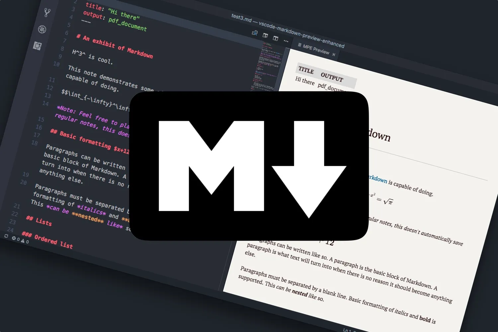

<!--
_paginate: false
header: Markdown Slides Template
footer: https://marpit.marp.app
 -->

# Markdown Slides Template

This template is based on the [Marpit-Project](https://marpit.marp.app/). It is a simple framework for creating slide decks from markdown files. It can transform markdown and CSS themes to a slide deck composed of static HTML and also print them to PDF and PPTX.

This template is designed to output minimum assets for the slide deck.

<!--
- based on the Marpit-Project
- framework for creating slide decks from markdown
- export to HTML, PDF, PPTX
- minimum assets
 -->

---

## Showcase



Based on the following example slides you can create your own slide deck using:

- Headlines
- Lists
- Tables
- Code blocks
- Code snippets
- Images
- Links

<!--
Use standard markdown syntax to create slides
some additional features are available
  - background images
  - directives
  - presenter notes
  - custom classes
 -->

---

<!--
header: Basic Markdown Syntax
 -->

# Basic Markdown Syntax

<div class="col-2">
<div>

## h2 - Headline

### h3 - Headline

#### h4 - Headline

##### h5 - Headline

###### h6 - Headline

Plain text

</div>
<div>

```md
# Basic Markdown Syntax

## h2 - Headline

### h3 - Headline

#### h4 - Headline

##### h5 - Headline

###### h6 - Headline

Plain text
```

</div>
</div>

---

## Unsorted Lists

```md
- list item 1
- list item 2
- list item 3
```

> - list item 1
> - list item 2
> - list item 3

---

## Sorted Lists

```md
1. list item 1
2. list item 2
3. list item 3
```

> 1. list item 1
> 2. list item 2
> 3. list item 3

---

## Tables

```md
| Collumn 1 | Column 2 | Column 3 |
| --------- | -------- | -------- |
| Cell 1    | Cell 2   | Cell 3   |
| Cell 1    | Cell 2   | Cell 3   |
```

> | Collumn 1 | Column 2 | Column 3 |
> | --------- | -------- | -------- |
> | Cell 1    | Cell 2   | Cell 3   |
> | Cell 1    | Cell 2   | Cell 3   |

---

## Code Blocks

````md
```bash
echo "hello world"
```
````

> ```bash
> echo "hello world"
> ```

---

## Code Snippets

```md
Using the `echo` command to print `hello world` to the console.
```

> Using the `echo` command to print `hello world` to the console.

---

## Links

```md
This template is based on the [Marpit-Project](https://marpit.marp.app/).
```

> This template is based on the [Marpit-Project](https://github.com/marp-team/marpit).

<!--
The difference between code blocks and code snippets is that code snippets are used to highlight a specific command or code part. Code blocks are used to display a larger code section.
 -->

---

<!--
header: Marp Specific Syntax
 -->

# Marp Specific Syntax

## Images

There are two types of images you can use.

- Inline images
  Displayed as part of the slides content.
- Background images
  Displayed in the background or in a split view. The background image is scaled to cover the entire page by default but can be adjusted using parameters in the alt text.

<!--
Because inline images are being styled using the template's CSS, the syntax varies from background images styled by marpit.
 -->

---

### Inline Images


Inline images are displayed as part of the slides content. This template supports some special modifiers for inline images.

- `center` - Align the image to the center
- `right` - Align the image to the right
- `40` - Scale the image to 40% of the available width.

```md

```

<!--
The corresponding classes can be viewed and modified in the CSS file.
 -->

---

<!--
_paginate: false
 -->

### Background Images

To define a background image add `bg` to the alt text of the image.

Additional modifiers can then be added to adjust the position and size of the image:

- `80%` - Scale the image to 80% of the available width
- `right:40%` - Position the image 40% from the right
- `opacity:50%` - Set the opacity of the image to 50%
- `blur:5px` - Set the blur of the image to 5px
- `grayscale` - Set the image to grayscale
- `invert` - Invert the colors of the image

```md

```


---

## Directives

You can use directives to define the layout of the slide. Directives will affect the current and all following slides until a new value is set.
Using underscores before a directive will limit it to the current slide.

```markdown
<!--
_paginate: false
header: Markdown Slides Template
footer: Hello World
_class: text-3xs
 -->
```

---

<!--
_footer: https://marp.app/docs/guide/directives#global-directives
 -->

### Global Directives

- `marp` - Set whether or not enable Marpc
- `title` - Set a title
- `description` - Set a description
- `author` - Set an author
- `keywords` - Set comma-separated keywords
- `size` - Choose the slide size preset provided by theme
- `theme` - Set a theme name
- `style` - Allows fine grained control over the CSS
- `headingDivider` - Place divider slides before headings
- `math` - Choose a library to render math typesetting
- `url` - Set canonical URL for the slide deck (for HTML export)
- `image` - Set Open Graph image URL (for HTML export)

---

<!--
_footer: https://marp.app/docs/guide/directives#local-directives
 -->

### Local Directives

- `header` - Specify the content of the slide header
- `footer` - Specify the content of the slide footer
- `paginate` - Show page number on the slide if set to `true`
- `class` - Set HTML class attribute for the slide element
- `backgroundColor` - Set background-color for the slide
- `backgroundImage` - Set background-image for the slide
- `backgroundPosition` - Set background-position for the slide
- `backgroundRepeat` - Set background-repeat for the slide
- `backgroundSize` - Set background-size for the slide
- `color` - Set text color

---

## Presenter Notes

When using a HTML or PPTX export for your presentation you can add presenter notes to your slides. These notes will not be displayed in the slide deck but can be used to provide additional information for the presenter.

All content written into HTML comments will be used as presenter notes.

```markdown
<!--
Presenter Notes:
This is a presenter note.
 -->
```

<!--
Presenter Notes:
This is a presenter note.
 -->

---

<!--
class: space-between
header: Template Features
 -->

# Template Features

## Custom Classes

This template also offers some custom classes to style the slides. The following classes are available:

- `text-*` - Changes the font size
  - `text-2xl` - Extra large
  - `text-2xs` - Extra small
- `col-*` - Splits the slide into columns. (Apply only to `<div>` elements)
  - `col-2` - Splits the slide into two columns
  - `col-3` - Splits the slide into three columns
- `space-between` - Adds space between list elements
- `text-col` - Changes the behavior of text alignment to columns

<!--
All of these classes are also defined in the CSS file and can be modified there.
 -->

---

<div class="col-2">
<div>

This is an example for a slide with two columns.

Markdown syntax does not support the use of classes on specific elements. Therefore HTML `<div>` elements are used.
The outer `<div>` element is used to define a container using the class `col-2`. The inner `<div>` elements then organize the content.

</div>
<div>

````md
<div class="col-2">
<div>

This is an example for a slide with two columns. The content is split into two equal parts.

</div>
<div>

```md
Let`s not start a recursive example.
```

</div>
</div>
````

</div>
</div>

---

<!--
header: Setup
_footer: https://marketplace.visualstudio.com/items?itemName=marp-team.marp-vscode
 -->

# Setup

## VS Code

Install the [Marp extension](https://marketplace.visualstudio.com/items?itemName=marp-team.marp-vscode) for VS Code to preview and export the slides. In the workspace settings there are some additional recommended settings.

---

## Marpit CLI

To use the Marpit CLI you need to install it using npm.

```bash
# Global install
npm install -g @marp-team/marp-cli

# Local install as defined in the package.json
npm install
```

---

You can then use your browser to preview the slides while working on them.

```bash
npx marp --html --allow-local-files --theme themes/profundis.css \
  --browser "firefox" --watch --output output.html main.md
```

After you are done you can export the slides to the desired format.

```bash
# HTML
npx marp --html --allow-local-files --theme themes/profundis.css \
  --browser "firefox" --page-size 4:3 --output output.pdf main.md

# PDF
npx marp --pdf --allow-local-files --theme themes/profundis.css \
  --browser "firefox" --page-size 4:3 --output output.pdf main.md

# PPTX
npx marp --pptx --allow-local-files --theme themes/profundis.css \
  --browser "firefox" --page-size 4:3 --output output.pdf main.md
```

---

The parameters used in the export commands are:

- `--html` - Export to HTML
- `--allow-local-files` - Allow local files to be used (can be unsafe)
- `--theme themes/profundis.css` - Link to theme as referenced in frontmatter
- `--browser "firefox"` - Browser to use for rendering
- `--page-size 4:3` - Aspect ratio of the slides
- `--watch` - Watch for changes and update the live preview
- `--output output.html` - Output file path
- `main.md` - Input file path

---

<!--
header: Kontakt
 -->

**Profundis Labs GmbH & Co. KG**
**Klausenburger Str. 9**
**D-81677 München**
**Tel. +49 89 235 1939 64**

<br>

Kontakt:

<div class="col-2">
<div>

Renè Ledosquet
ledosquet@profundis-labs.de

</div>
<div>

Philipp Rocholl
rocholl@profundis-labs.de

</div>
<div>

Wolfgang Aigner
aigner@profundis-labs.de

</div>
<div>

Michael Edelmann
edelmann@profundis-labs.de

</div>
<div>

Sascha Fitz
fitz@profundis-labs.de

</div>
<div>

Florian Hektor
hektor@profundis-labs.de

</div>
</div>
